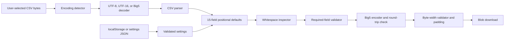

# CSV to Fixed-Width Big5 Converter — Design Specification

A privacy-first browser application that converts CSV files into a 15-column,
fixed-width Big5 text format. All file reading, validation, conversion, and
download generation happen in the user's browser. No CSV data is uploaded to a
server.

> **Project status:** a minimum working browser flow and pure conversion core are
> implemented. Automated tests, JSON settings import/export, and the remaining
> release-hardening items are follow-up work.

## Contents

- [Problem statement](#problem-statement)
- [Goals and non-goals](#goals-and-non-goals)
- [Key decisions](#key-decisions)
- [Legacy Office compatibility risks](#legacy-office-compatibility-risks)
- [User experience](#user-experience)
- [Functional requirements](#functional-requirements)
- [Default 15-column profile](#default-15-column-profile)
- [Data model](#data-model)
- [Conversion rules](#conversion-rules)
- [Encoding detection](#encoding-detection)
- [Validation and errors](#validation-and-errors)
- [Settings persistence](#settings-persistence)
- [Architecture](#architecture)
- [Privacy and security](#privacy-and-security)
- [Browser and offline behavior](#browser-and-offline-behavior)
- [Accessibility and compatibility](#accessibility-and-compatibility)
- [Testing strategy](#testing-strategy)
- [Delivery plan](#delivery-plan)
- [Acceptance criteria](#acceptance-criteria)
- [Open decisions](#open-decisions)

## Problem statement

The existing workflow converts CSV to XLS and then uses Microsoft Office/Access
to export fixed-width text. That approach is manual and makes it difficult to
guarantee consistent validation, byte widths, character encoding, and privacy.

The replacement must:

1. Accept a CSV encoded as UTF-8, UTF-16, or Big5.
2. Read exactly 15 positional source columns and write exactly 15 output fields
   in the same order.
3. Substitute user-configured defaults when corresponding input cells are empty.
4. reject missing values for required output fields.
5. Format every field to a predefined, user-editable Big5 byte width.
6. Download a Big5 fixed-width text file without sending source data anywhere.
7. Remember non-sensitive preferences where the browser provides reliable
   persistent storage.

## Goals and non-goals

### Goals

- Run as a static site on GitHub Pages.
- Perform all sensitive-data processing locally in the browser.
- Support CSV input decoded as UTF-8, UTF-16, or Big5.
- Produce exactly 15 output fields in a deterministic order.
- Require exactly 200 parsed data records by default, with an editable expected
  record count in global settings.
- Measure fixed widths in encoded Big5 bytes.
- Validate required values, byte overflow, malformed CSV, and characters that
  cannot be represented safely in Big5.
- Present the entire user interface in Traditional Chinese (`zh-Hant`).
- Label fields only as `欄位1` through `欄位15`; these are UI labels and
  are never emitted as a header or read from the source data.
- Let users edit fallback values, required flags, and widths, with one alignment
  setting applied to all fields.
- Persist settings in `localStorage` and support JSON import/export.
- Provide row- and field-specific error messages before download.
- Keep the application small, framework-free, and maintainable.

### Non-goals for the first release

- Server-side file storage or conversion.
- User accounts or cloud synchronization.
- XLS/XLSX input or output.
- Automatic transliteration of characters unavailable in Big5.
- Supporting arbitrary output schemas beyond the predefined 15 fields.
- Silently truncating overlong values.
- Guaranteeing charset detection without user confirmation.
- Reproducing unspecified Office/Access behavior that is not present in an
  approved sample output file.

## Key decisions

| Area | Decision | Reason |
|---|---|---|
| Fixed width | Count Big5 bytes | Legacy consumers usually address byte positions; Chinese characters normally occupy two Big5 bytes while ASCII occupies one. |
| Overflow | Block conversion | Silent truncation can corrupt identifiers and must not be the default. |
| Unencodable text | Block conversion | Replacing characters with `?` would cause undetected data loss. |
| Default trigger | An exactly empty parsed CSV string (`""`) | Whitespace is preserved and does not silently trigger a default. |
| Required check | Must contain a non-whitespace character | A required value made only of spaces is not meaningful and blocks download. |
| Charset detection | Best effort plus user override | Some byte streams, especially ASCII, are valid in both UTF-8 and Big5. |
| Processing | Browser only | Source files contain sensitive data. |
| Settings | `localStorage` plus JSON backup | Convenient on stable web origins, with a portable recovery mechanism. |
| UI stack | TypeScript and DOM APIs, no UI framework | The workflow is small and does not need a framework runtime. |
| CSV parser | Papa Parse | Correct handling of quoted fields, embedded delimiters, and multiline values. |
| Big5 encoder | `iconv-lite` bundled locally | Browser `TextEncoder` only produces UTF-8. |
| UI language | Traditional Chinese only | The target users are Traditional Chinese readers. |
| Output labels | `欄位1`–`欄位15` | Business names and subtitles are intentionally unnecessary. |
| Field association | Fixed one-to-one position | Source column 1 becomes `欄位1`, source column 2 becomes `欄位2`, and so on. No mapping control is needed. |
| Alignment | One global setting, default left | The same padding direction applies to all 15 fields. |
| Record count | Exactly 200 by default | The expected number is a positive integer editable in global settings. |
| Output newline | CRLF (`\r\n`) | The target workflow is Windows-oriented; LFCR (`\n\r`) is invalid. |
| Final newline | Included | Every output record, including the last, ends with CRLF. |
| Source whitespace | Preserve and highlight | Never trim or normalize silently; suspicious whitespace is visible in preview. |

## Legacy Office compatibility risks

The old `CSV → XLS/XLSX → Access → TXT` process has two independent type-
inference stages and cannot be reproduced safely from its wizard screenshots
alone.

### Known risks

- Excel can convert leading-zero identifiers to numbers, long numbers to
  limited-precision/scientific values, date-like text to dates, and values such
  as `1E10` to scientific notation. The exact result depends on how the CSV was
  opened, the Office version, automatic-conversion settings, and locale.
- Excel Power Query enables automatic type detection for CSV and other
  unstructured sources unless the user overrides the column type.
- When Access imports an Excel worksheet into a new table, it examines the
  first eight rows of each column to suggest a field type. Mixed values later
  in the file can consequently be lost or converted incorrectly.
- Access export settings such as YMD, date separator `/`, and time separator
  `:` affect values that have become Date/Time fields. They do not establish
  that any particular source column was a date, and should not transform text
  fields.
- Boolean, null, number, and date formatting may therefore differ from the raw
  CSV even when the final fixed-width layout is correct.

References: [Excel automatic data conversions](https://support.microsoft.com/en-US/Excel/data-import-and-analysis-options-in-excel),
[preserving leading zeros and long numbers](https://support.microsoft.com/en-US/Excel/keeping-leading-zeros-and-large-numbers),
and [Access importing from Excel](https://support.microsoft.com/en-US/Access/import-or-link-to-data-in-an-excel-workbook).

### Safe behavior without production data

The browser converter treats all 15 source values as text and performs no
automatic number, boolean, date, or time conversion. It preserves leading
zeros, punctuation, spacing, and date-like strings. Any future transformation
must be explicit, profile-driven, and covered by a byte-level fixture; it must
never be introduced as a heuristic.

Development can validate parsing, encoding, padding, row counts, and error
handling with synthetic data. It cannot claim compatibility with the external
system until at least one of these evidence sources exists:

1. A written external-system format specification.
2. A sanitized source CSV and accepted TXT pair.
3. A synthetic 15-column CSV processed by the old Office workflow, with its
   resulting TXT used as a golden fixture.

A synthetic characterization fixture should contain values such as `00123`,
`20260102`, `01/02/2026`, `12:30`, `1E10`, a number longer than 15 digits,
`TRUE`, empty values, ASCII spaces, full-width spaces, and Big5 edge cases.

When real data can only be processed by an authorized user, a future local
diagnostic mode may export content-free statistics: encoding result, record and
column counts, empty counts, min/max byte lengths, overflow counts,
unencodable-character counts, output size, and a SHA-256 hash. A local old/new
TXT comparison should report size, hash, and first differing record/field
without uploading either file.

Until a golden fixture is accepted, releases must be described as compatibility
candidates rather than certified replacements for the Office workflow.

## User experience

The application is a single-page workflow with five stages.

### 1. Select input

- Choose or drag one `.csv` file.
- Read the file with the browser File API.
- Display the filename and byte size.
- Do not persist the file or its contents.

### 2. Confirm input format

- Show the detected source encoding: UTF-8, UTF-16LE, UTF-16BE, Big5, or
  ambiguous.
- Let the user select `自動判斷（預設）`, `UTF-8`, `UTF-16`, or `Big5`.
- Show a decoded preview of a small number of rows.
- Treat the source as positional data with no header row. Every row must contain
  exactly 15 values.

### 3. Configure 15 fields

Render one row for every output field with:

| Control | Behavior |
|---|---|
| Output field | Read-only `欄位1` through `欄位15` |
| Width | Positive integer measured in Big5 bytes |
| Required | User-selectable `不可空白` checkbox |
| Default value | Used only when the corresponding source cell is empty |
| Accumulated width | Read-only running total recalculated whenever a width changes |

Above the table, one global alignment dropdown applies `靠左` or `靠右` to all
15 output fields. It defaults to `靠左`. The global settings also contain an
`預期資料筆數` positive-integer input that defaults to `200`.

The settings screen also provides:

- Save preferences
- Restore predefined defaults
- Export settings as JSON
- Import settings from JSON

### 4. Validate and preview

- Resolve required rules and defaults for every record.
- Validate all 15 fields.
- Require the parsed record count to equal the configured expected count.
- Display expected, actual, valid, and invalid record counts.
- Display a separate whitespace-warning count.
- Display errors with source record number, output field, and reason.
- Identify empty records and whitespace-only records explicitly instead of
  silently skipping them.
- Show the first 20 valid record previews and all validation errors, with a
  sensible display cap for extremely invalid files.
- Mark whitespace without changing the value: ASCII space as `·`, full-width
  space as `□`, tab as `→`, and embedded line break as `↵`. The actual output
  continues to contain the original characters, not these markers.
- Visually distinguish whitespace from the source from padding added by the
  fixed-width formatter.
- Preview fixed-width output using a monospace font, while clearly noting that
  the authoritative measurement is byte length rather than visual width.

### 5. Download

- Enable download only when the full input passes validation.
- Generate a Big5 byte array in memory.
- Download a `.txt` file with CRLF after every record, including the last.
- Clear file-derived state when the user selects **Start over**.

## Functional requirements

### File input

- **FR-001:** Accept exactly one file per conversion.
- **FR-002:** Read the file as bytes, not with `File.text()`, so decoding remains
  under application control.
- **FR-003:** Reject an empty file.
- **FR-004:** Enforce a configurable file-size limit. Initial proposal: 25 MiB.
- **FR-005:** Never store the source byte array in persistent browser storage.

### CSV decoding and parsing

- **FR-010:** Detect a UTF-8 BOM when present.
- **FR-011:** Detect UTF-16LE and UTF-16BE BOMs when present.
- **FR-012:** Validate UTF-8 strictly before treating input as UTF-8.
- **FR-013:** Require user confirmation when detection is ambiguous or invalid.
- **FR-014:** Parse quoted delimiters, escaped quotes, and embedded line breaks.
- **FR-015:** Report malformed CSV rather than attempting a partial export.
- **FR-016:** Preserve cell text exactly after CSV unquoting; do not trim it.
- **FR-017:** Treat every parsed row, including the first, as source data.
- **FR-018:** Attempt strict Big5 decoding when Unicode validation fails.
- **FR-019:** For BOM-less UTF-16, use a conservative null-byte heuristic and
  require the decoded preview to be confirmed.
- **FR-019A:** Parse with empty-line skipping disabled so blank records remain
  available for validation.

### Field validation and defaults

- **FR-020:** Always create exactly 15 output fields in profile order.
- **FR-021:** Require every source row to contain exactly 15 parsed CSV values.
- **FR-022:** Map source column N directly to output field N.
- **FR-023:** Apply the default only when the parsed input value equals `""`.
- **FR-024:** Validate defaults with the same rules as source values.
- **FR-025:** Reject rows with fewer or more than 15 values.
- **FR-026:** Require the number of parsed data records to equal the configured
  expected count, defaulting to 200.
- **FR-027:** Do not treat a single final record terminator as an extra blank
  record.
- **FR-028:** Report blank and whitespace-only records with their source
  positions. A line break inside a properly quoted CSV field is not a record
  boundary and must not be reported as an empty record.

### Whitespace inspection

- **FR-029:** Preserve source whitespace exactly; never trim, collapse, replace,
  or normalize it automatically.
- **FR-029A:** Mark every source whitespace character in preview without
  modifying the underlying value.
- **FR-029B:** Warn on leading or trailing whitespace in a field.
- **FR-029C:** Warn on full-width space (`U+3000`), non-breaking space
  (`U+00A0`), and other non-ASCII space characters.
- **FR-029D:** Treat a required field containing only whitespace as missing and
  block download.
- **FR-029E:** For an optional whitespace-only field, preserve the value and
  display a warning. Do not apply its default because defaults apply only to an
  exactly empty string.
- **FR-029F:** Reject tab, carriage return, line feed, and other unsupported
  control characters inside field values because they can change the external
  system's record or column interpretation.
- **FR-029G:** Count source whitespace as part of the encoded field width before
  adding output padding.

### Fixed-width Big5 output

- **FR-030:** Encode values with the project's selected Big5/CP950 mapping.
- **FR-031:** Measure each resolved value after Big5 encoding.
- **FR-032:** Reject values whose encoded length exceeds the configured width.
- **FR-033:** Pad short values with ASCII space bytes (`0x20`).
- **FR-034:** Append padding on the right for left alignment and on the left for
  right alignment.
- **FR-035:** Concatenate the 15 encoded fields with no delimiter.
- **FR-036:** Use CRLF (`\r\n`, bytes `0D 0A`) after each output record; this is
  not exposed as a global option.
- **FR-037:** Append CRLF after the final output record.
- **FR-038:** Download the exact generated bytes without a UTF-8 BOM.
- **FR-039:** Recalculate and display cumulative width after every width edit;
  the preset total is 208 Big5 bytes.

### Settings

- **FR-040:** Load predefined settings on first use.
- **FR-041:** Save user preferences under a versioned storage key.
- **FR-042:** Recover gracefully from absent, invalid, or outdated stored JSON.
- **FR-043:** Support JSON export and import.
- **FR-044:** Validate imported settings before applying them.
- **FR-045:** Never store uploaded filenames, previews, rows, or output content.

## Default 15-column profile

The output labels and initial byte widths are fixed below. Widths remain
editable by the user. `累計寬度` means the one-based end position of that field
in the output record. The preset record width is 208 Big5 bytes.

Required flags default to unchecked and are selected by the user. Global
alignment defaults to left.

| Position | UI label | Preset width (bytes) | Accumulated width (bytes) |
|---:|---|---:|---:|
| 1 | 欄位1 | 1 | 1 |
| 2 | 欄位2 | 2 | 3 |
| 3 | 欄位3 | 1 | 4 |
| 4 | 欄位4 | 10 | 14 |
| 5 | 欄位5 | 10 | 24 |
| 6 | 欄位6 | 8 | 32 |
| 7 | 欄位7 | 12 | 44 |
| 8 | 欄位8 | 1 | 45 |
| 9 | 欄位9 | 120 | 165 |
| 10 | 欄位10 | 15 | 180 |
| 11 | 欄位11 | 10 | 190 |
| 12 | 欄位12 | 1 | 191 |
| 13 | 欄位13 | 8 | 199 |
| 14 | 欄位14 | 8 | 207 |
| 15 | 欄位15 | 1 | 208 |

These labels exist only in the interface. They are not source headers and must
not appear in the output bytes. The implemented profile must be tested against
an approved CSV and Access-generated TXT fixture.

## Data model

```ts
type SourceEncoding = "auto" | "utf-8" | "utf-16" | "big5";
type Alignment = "left" | "right";

interface ColumnConfig {
  id: string;
  position: number;       // 1 through 15
  widthBytes: number;
  required: boolean;
  defaultValue: string;
}

interface SettingsV2 {
  version: 2;
  sourceEncoding: SourceEncoding;
  alignment: Alignment;
  expectedRows: number;
  columns: [
    ColumnConfig, ColumnConfig, ColumnConfig, ColumnConfig, ColumnConfig,
    ColumnConfig, ColumnConfig, ColumnConfig, ColumnConfig, ColumnConfig,
    ColumnConfig, ColumnConfig, ColumnConfig, ColumnConfig, ColumnConfig,
  ];
}

type ValidationSeverity = "error" | "warning";

interface ValidationIssue {
  severity: ValidationSeverity;
  code:
    | "MISSING_REQUIRED"
    | "INVALID_COLUMN_COUNT"
    | "INVALID_RECORD_COUNT"
    | "EMPTY_RECORD"
    | "WHITESPACE_ONLY_RECORD"
    | "WHITESPACE_ONLY_FIELD"
    | "LEADING_WHITESPACE"
    | "TRAILING_WHITESPACE"
    | "NON_ASCII_WHITESPACE"
    | "UNSUPPORTED_CONTROL_CHARACTER"
    | "UNENCODABLE_BIG5"
    | "WIDTH_OVERFLOW"
    | "MALFORMED_CSV"
    | "INVALID_SETTINGS";
  sourceRow?: number;
  fieldId?: string;
  message: string;
}
```

Runtime validation is still required because TypeScript types do not validate
JSON loaded from `localStorage` or a user-selected settings file.

## Conversion rules

For each parsed CSV row and each of the 15 configured fields:

```text
sourceValue = source row value at the same one-based position
resolvedValue = sourceValue

if sourceValue is exactly "" and defaultValue is not "":
    resolvedValue = defaultValue

if required and resolvedValue contains no non-whitespace characters:
    add MISSING_REQUIRED error
    stop processing this field

inspect resolvedValue for source whitespace
add non-blocking leading/trailing/non-ASCII whitespace warnings
reject unsupported control characters

encodedValue = encode resolvedValue as Big5

if encoding is lossy or cannot round-trip safely:
    add UNENCODABLE_BIG5 error
    stop processing this field

if encodedValue.length > widthBytes:
    add WIDTH_OVERFLOW error
    stop processing this field

padding = ASCII spaces repeated (widthBytes - encodedValue.length)
outputField = encodedValue + padding when settings.alignment is left
outputField = padding + encodedValue when settings.alignment is right
```

After all fields pass, concatenate them in ascending position and append the
bytes `0D 0A` after every record, including the last.

With the presets, a successful 200-record file has a deterministic size:

```text
record bytes     = 208
CRLF bytes       = 2
bytes per record = 210
total bytes      = 200 × 210 = 42,000
```

Without a final CRLF the file would be 41,998 bytes, but that is not this
project's output contract.

### Big5 safety check

`iconv-lite` may replace unavailable characters rather than throw. The encoder
adapter must detect loss. The initial approach is:

1. Encode the Unicode value to Big5.
2. Decode those bytes back to Unicode.
3. Compare the decoded value to the original under the project's documented
   normalization policy.
4. Reject the value if it differs.

No normalization should be performed implicitly in the first release. Test
fixtures must cover mappings that decode to multiple Unicode code points.

## Encoding detection

Detection is advisory, never authoritative.

```text
if bytes start with EF BB BF:
    result = UTF-8
else if bytes start with FF FE:
    result = UTF-16LE
else if bytes start with FE FF:
    result = UTF-16BE
else if strict UTF-8 decoding succeeds:
    if bytes are ASCII-only:
        result = ambiguous (UTF-8 or Big5)
    else:
        result = likely UTF-8
else if byte distribution strongly indicates BOM-less UTF-16:
    result = likely UTF-16LE or UTF-16BE; require preview confirmation
else if strict Big5 decoding succeeds:
    result = likely Big5
else:
    result = invalid or unsupported
```

Some non-ASCII streams can also be valid under both encodings. The preview and
manual selector are therefore required. Changing the selector must re-decode
and re-parse the original byte array.

## Validation and errors

### Blocking errors

- Empty or oversized input file
- Unsupported or invalid input encoding
- Malformed CSV
- Parsed record count different from the configured expected count
- Empty or whitespace-only source record
- Source row with fewer or more than 15 values
- Missing or whitespace-only required output value
- Tab, embedded CR/LF, or other unsupported control character inside a field
- Invalid field width
- Big5-unencodable or lossy value
- Encoded value wider than its configured field
- Invalid imported settings

### Error presentation

- Show a summary count and a filterable table.
- Show expected, actual, valid, and invalid record counts above the preview.
- Show a whitespace-warning count without including warnings in the error count.
- Number parsed data records from 1 in source order. When quoted multiline CSV
  fields make physical line numbers different, include the physical line or
  line range as additional context when available.
- Name the output field and show its position.
- Do not expose complete sensitive rows unnecessarily.
- Display the offending value only while the file remains loaded, and consider
  masking it in a future high-privacy mode.
- Render source values with DOM `textContent`, never by inserting untrusted CSV
  text as HTML.
- Allow downloading an error report only after an explicit user action.

Whitespace warnings do not alter source values. Leading/trailing or non-ASCII
space warnings do not block conversion, while whitespace-only required values
and unsupported control characters do. Ambiguous charset warnings require user
confirmation.

Example Traditional Chinese validation messages:

```text
資料筆數錯誤：預期 200 筆，實際 198 筆。
第 42 筆是空白列。
第 88 筆只有空白字元。
第 12 筆共有 14 欄，應為 15 欄。
第 5 筆的欄位9超過 120 位元組。
第 7 筆的欄位4前方含有空白字元。
第 9 筆的欄位6含有全形空白。
```

## Settings persistence

Settings are stored under:

```text
csv2txt.settings.v2
```

### Stored

- Field widths
- Required flags
- Defaults
- Global alignment
- Encoding preference
- Expected record count

### Never stored

- Source or output file bytes
- CSV rows or previews
- Validation values
- Uploaded filenames or local paths

All storage access must be wrapped in `try/catch`. If storage is unavailable,
the app continues with in-memory settings and explains that preferences will
not persist.

JSON settings import/export provides portability and recovery. Imported JSON
must have a supported version, exactly 15 uniquely positioned columns, unique
IDs, positive integer widths, known enum values, and no unknown executable
content.

## Architecture



Recommended source boundaries:

```text
src/
  app/                 UI orchestration and state
  config/              Built-in 15-column profile
  core/
    encoding.ts        Detection, decoding, and Big5 encoding adapter
    csv.ts             Papa Parse adapter
    defaults.ts        Positional default resolution
    fixed-width.ts     Validation, byte padding, and record assembly
    settings.ts        Runtime validation and migration
  ui/                  DOM rendering and accessible components
  main.ts              Browser entry point
  styles.css
tests/
  fixtures/            Synthetic, non-sensitive CSV/TXT samples
  unit/
  integration/
```

Core modules must not depend on DOM APIs. Keeping byte conversion pure makes it
possible to unit-test the most safety-critical behavior.

## Privacy and security

### Data flow guarantees

- File input uses an explicit user gesture.
- The browser only exposes the selected file to the page.
- Processing stays in memory.
- The application has no upload endpoint.
- Production assets are bundled; runtime CDNs are forbidden.
- Analytics, trackers, error-reporting SDKs, and remote fonts are forbidden.
- Settings contain configuration only.

### Content Security Policy target

The deployed application should use a policy equivalent to:

```text
default-src 'self';
script-src 'self';
style-src 'self';
img-src 'self' data:;
connect-src 'none';
font-src 'self';
object-src 'none';
base-uri 'none';
form-action 'none';
frame-ancestors 'none';
```

GitHub Pages cannot set arbitrary response headers. A CSP `<meta>` element can
cover most directives, but directives unsupported in meta delivery must be
documented. If strict header control becomes mandatory, deploy the same static
assets on a host that supports response headers.

Dependencies are locked with `package-lock.json`, reviewed, and updated by
small pull requests. CI uses `npm ci` for reproducible installs.

## Browser and offline behavior

### GitHub Pages

GitHub Pages is the primary runtime:

- Stable HTTPS origin
- Reliable origin-scoped `localStorage`
- Normal ES-module and asset loading
- No server-side access to files selected in the browser
- A production service worker precaches the application shell and all generated
  assets. The UI reports when installation is complete; after that point the
  page can be reloaded and used without a network connection.

Moving the site to another scheme, host, or port creates a different storage
origin, so saved preferences do not automatically follow it.

### Double-clicked local HTML

A local page runs under a `file://` URL. The File API and Blob download can work,
but browsers may block module imports or related-file fetches. `localStorage`
behavior for `file://` is not standardized and must not be relied upon.

The optional offline release should therefore be one self-contained HTML file
with bundled classic JavaScript, CSS, encoding tables, and CSV parser. It must
make no network requests and must retain JSON settings import/export as the
portable persistence mechanism.

Serving the normal development build from `localhost` is not the same as
uploading data; it provides a stable local origin while conversion remains in
the browser.

## Accessibility and compatibility

- Target current stable Chrome, Edge, Firefox, and Safari.
- Use semantic form controls and an actual table for the 15-field editor.
- Associate every control with a visible label.
- Make all actions keyboard accessible.
- Do not communicate validity through color alone.
- Announce validation summaries with an appropriate live region.
- Move focus to the error summary after a failed conversion.
- Meet WCAG 2.2 AA contrast and focus-visible requirements.
- Use responsive layout without hiding configuration columns; smaller screens
  may present one output field as a card.

## Performance limits

The initial release targets files up to 25 MiB. Parsing and validation should
not freeze the page for longer than a perceptible interaction interval.

Implementation order:

1. Use in-memory processing for correctness and simplicity.
2. Measure realistic files on supported browsers.
3. Move parsing/conversion to a Web Worker if the UI becomes unresponsive.
4. Consider chunked output only after profiling; do not complicate encoding
   boundaries prematurely.

## Testing strategy

All fixtures must be synthetic and contain no production data.

### Unit tests

- UTF-8 BOM and strict UTF-8 validation
- UTF-16LE/BE BOM and conservative BOM-less detection
- Valid, invalid, ambiguous, and ASCII-only charset cases
- Big5 decode and encode round trips
- ASCII one-byte and Chinese two-byte width accounting
- Unencodable Unicode, emoji, and uncommon Han characters
- Required/default resolution
- Empty string versus whitespace-only value
- Leading, trailing, repeated, full-width, and non-breaking spaces
- Whitespace-only optional and required fields
- Tab, embedded CR/LF, and unsupported control characters
- Source whitespace distinguished from generated padding
- Left and right padding
- Exact width and one-byte overflow
- Settings validation and version rejection
- CRLF ordering and mandatory final CRLF

### CSV tests

- First CSV row treated as data
- Commas inside quotes
- Escaped quotes
- Embedded CRLF inside a quoted cell
- Empty cells and trailing empty cells
- Empty and whitespace-only records with exact source positions
- Whitespace markers and Traditional Chinese warning messages
- Rows with fewer or more than 15 values
- Malformed quotations

### Integration tests

- UTF-8 CSV to expected Big5 TXT bytes
- UTF-16LE and UTF-16BE CSV to expected Big5 TXT bytes
- Big5 CSV to expected Big5 TXT bytes
- Fifteen fields in exact order and preset total length of 208 bytes
- Live cumulative widths of 1, 3, 4, 14, 24, 32, 44, 45, 165, 180, 190,
  191, 199, 207, and 208
- One global alignment setting applied to all fields
- Default expected count of 200 and configurable positive-integer counts
- Exactly 200 preset records produce 42,000 bytes
- CRLF after every record, including the final record
- A terminal CRLF does not create a 201st empty record during input validation
- Preferences save/restore and JSON round trip
- Download blocked when any record is invalid
- Whitespace warnings preserve byte-identical source values

### Legacy compatibility test

Obtain one approved source CSV and its Access-generated TXT output, sanitize the
values, and commit the sanitized pair as fixtures. The browser output must match
the expected TXT byte-for-byte.

## Delivery plan

### Milestone 0 — legacy compatibility contract

- Supply a sanitized source/output fixture pair.
- Run the synthetic Office characterization fixture and document all observed
  conversions.
- Confirm the external system accepts the documented CRLF and final-CRLF
  contract.

### Milestone 1 — pure conversion core

- Implement settings validation.
- Implement positional validation and default rules.
- Implement Big5 safety checks and byte-width output.
- Add unit and byte-for-byte fixture tests.

### Milestone 2 — browser workflow

- Implement file selection, detection, CSV parsing, preview, configuration, and
  validation UI.
- Add accessible error handling and downloads.
- Add `localStorage` plus JSON settings backup.

### Milestone 3 — release hardening

- Cross-browser and accessibility verification.
- File-size and responsiveness testing.
- Strict CSP verification.
- GitHub Pages deployment.
- Optional self-contained offline artifact.

## Acceptance criteria

The first production release is accepted when:

1. A supported UTF-8, UTF-16, or Big5 CSV can be processed without network
   requests.
2. Exactly 15 configured fields are emitted in order.
3. Defaults are applied only to empty source values in the same field position.
4. Required empty values block download with row/field errors.
5. Every field occupies exactly its configured number of Big5 bytes.
6. Overflow and lossy Big5 encoding block download.
7. Output matches the approved legacy fixture byte-for-byte.
8. Ambiguous encoding requires visible confirmation or override.
9. Settings persist on a stable origin and survive JSON export/import.
10. Uploaded and generated data are absent from persistent browser storage.
11. CI type-checks and builds the project successfully.
12. Keyboard-only operation completes the full workflow.
13. Every visible UI label and message is Traditional Chinese.
14. Preset widths total 208 bytes and cumulative widths update live after edits.
15. One global alignment choice controls all 15 fields.
16. The default validation requires exactly 200 parsed data records.
17. Empty records are reported with their source positions.
18. Output uses `\r\n`, never `\n\r`, after all records including the last.
19. Source whitespace is visible in preview and is never silently modified.
20. Whitespace-only required fields and unsupported control characters block
    download; non-blocking whitespace warnings remain clearly visible.

## Open decisions

The following block byte-for-byte acceptance:

1. Exact Big5 variant expected by the consumer: WHATWG Big5, CP950, or another
   vendor-specific mapping.
2. A sanitized CSV and Access-generated TXT pair for compatibility testing.
3. Confirmation that the external system accepts the CRLF/final-CRLF contract.
4. Production file-size expectations.
5. Project license. No license has been selected; do not assume permission for
    redistribution until the repository owner adds one.
